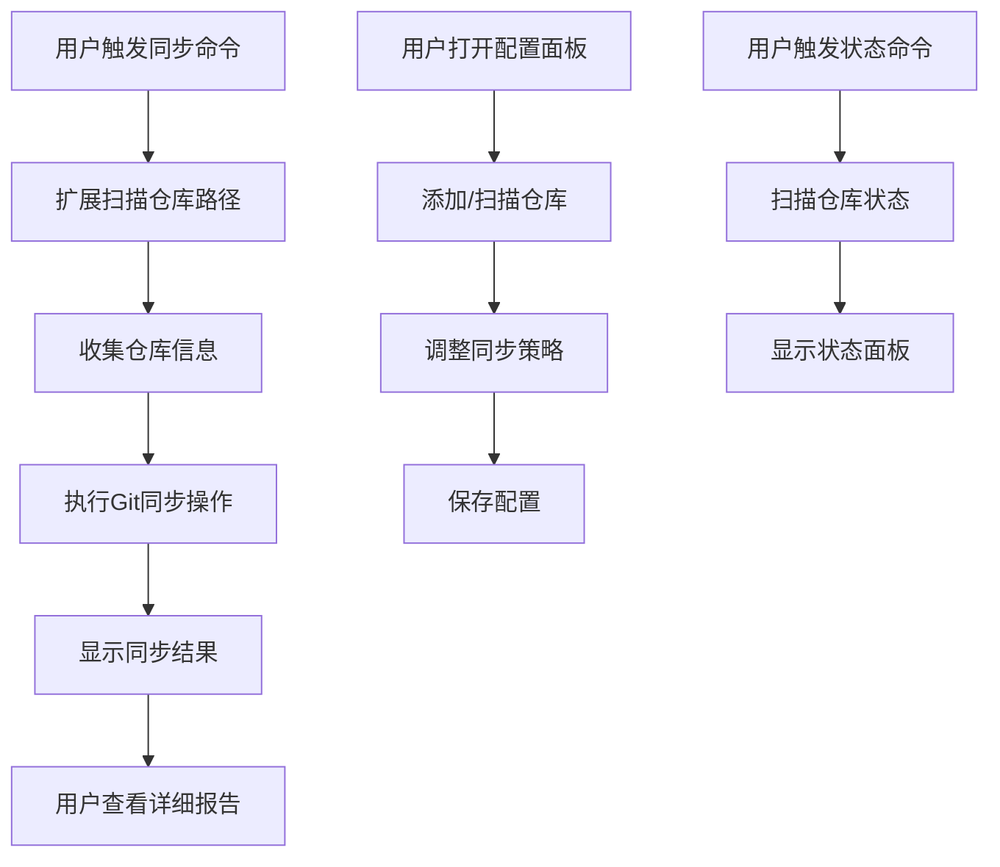

# Sync All Repos VS Code 扩展产品需求文档

## 1. 产品概览

Sync All Repos 是一款 VS Code 扩展，旨在帮助开发者一键同步多个 Git 仓库，实现多仓库代码的一致性管理。

- **解决问题**：在多仓库开发环境中，开发者需要频繁手动同步每个仓库的代码，操作繁琐且容易遗漏。
- **核心价值**：通过自动化的批量操作，减少手动同步的工作量，确保代码库的一致性，提高开发效率。
- **目标用户**：需要管理多个 Git 仓库的开发者、DevOps 工程师以及任何需要保持多仓库代码同步的技术人员。

## 2. 核心功能

### 2.1 功能模块

我们的 Sync All Repos 扩展包含以下主要功能模块：

| 模块名称 | 模块描述 |
|---------|--------|
| 仓库管理 | 支持手动添加仓库路径和自动扫描仓库，可配置扫描深度和排除目录 |
| 同步操作 | 提供全量同步（pull + push）、仅拉取（pull only）、仅推送（push only）三种模式 |
| 同步策略 | 支持不同的 Git 同步策略，如 merge、rebase、ff-only 等 |
| 状态管理 | 实时显示仓库同步状态，包括分支信息、远程仓库、提交状态等 |
| 自动操作 | 支持保存文件时自动同步、推送前自动提交等自动化功能 |
| 配置管理 | 提供可视化的配置面板，方便用户调整扩展行为 |

### 2.2 页面详情

| 页面名称 | 模块名称 | 功能描述 |
|---------|---------|--------|
| 主面板 | 仓库管理 | 显示所有配置的仓库列表，包含仓库名称、分支、远程仓库、同步状态等信息 |
| 主面板 | 同步操作 | 提供同步所有、仅拉取、仅推送等操作按钮，支持批量操作选中的仓库 |
| 主面板 | 状态管理 | 实时显示同步进度和结果，包括成功、失败、跳过的仓库数量 |
| 主面板 | 配置管理 | 提供同步策略、并发数、自动提交等配置选项 |
| 状态栏 | 状态管理 | 显示扩展当前状态，同步时显示动画效果，完成后显示结果 |
| 命令面板 | 同步操作 | 提供所有同步相关命令，可通过快捷键或命令面板调用 |

## 3. Core Process

### 3.1 主要用户操作流程

**同步所有仓库流程**：
1. 用户打开 VS Code 并激活 Sync All Repos 扩展
2. 用户通过命令面板或状态栏按钮触发 "Sync All Repos: 同步所有仓库" 命令
3. 扩展开始扫描配置的仓库路径
4. 扩展并发执行 Git 同步操作（pull + push）
5. 扩展显示同步进度和结果
6. 同步完成后，用户可以查看详细的同步报告

**配置仓库流程**：
1. 用户打开 Sync All Repos 主面板
2. 用户点击 "添加目录" 按钮选择仓库目录，或点击 "重新扫描" 自动发现仓库
3. 用户调整同步策略、并发数等配置选项
4. 用户保存配置

**查看仓库状态流程**：
1. 用户触发 "Sync All Repos: 查看仓库状态" 命令
2. 扩展扫描所有配置的仓库并收集状态信息
3. 扩展显示仓库状态面板，包含分支、远程仓库、提交状态等信息

### 3.2 流程图

## 4. 用户接口设计

### 4.1 界面设计概览

- **主面板**：采用深色主题设计，与 VS Code 原生风格一致，包含仓库列表、操作按钮、配置选项和日志显示区域
- **状态栏**：在 VS Code 状态栏左侧显示扩展状态，提供快速操作入口
- **命令面板**：通过命令面板提供所有扩展功能的访问方式
- **配置界面**：集成在主面板中，提供直观的配置选项

### 4.2 页面设计概览

| 页面名称 | 模块名称 | UI元素 |
|---------|---------|-------|
| 主面板 | 仓库管理 | 表格形式展示仓库列表，包含复选框、状态图标、仓库名称、分支、远程仓库、同步状态等列 |
| 主面板 | 同步操作 | 顶部工具栏包含 "同步所有"、"仅拉取"、"仅推送" 按钮，支持批量操作 |
| 主面板 | 状态管理 | 顶部状态栏显示同步统计信息，包括总计、成功、失败的仓库数量，以及进度条 |
| 主面板 | 配置管理 | 顶部配置栏提供同步策略、并发数、自动提交等配置选项 |
| 主面板 | 日志显示 | 下部区域实时显示 Git 执行日志，支持日志过滤、自动滚动和复制功能 |
| 状态栏 | 状态管理 | 显示扩展状态，同步时显示动画效果，完成后显示结果 |

### 4.3 详细 UI 组件描述

#### 4.3.1 工具栏组件

工具栏位于主面板顶部，包含以下按钮：

| 按钮名称 | 功能描述 | 交互方式 | 视觉样式 |
|---------|---------|---------|---------|
| 同步所有 | 执行全量同步（pull + push）操作 | 点击触发同步流程 | 蓝色背景白色文字，圆角矩形 |
| 仅拉取 | 仅执行 git pull 操作 | 点击触发拉取流程 | 透明背景蓝色边框，圆角矩形 |
| 仅推送 | 仅执行 git push 操作 | 点击触发推送流程 | 透明背景蓝色边框，圆角矩形 |
| 添加仓库 | 打开文件选择对话框添加新仓库 | 点击弹出文件选择器 | 透明背景蓝色边框，圆角矩形 |
| 重新扫描 | 自动扫描配置目录发现新仓库 | 点击触发扫描流程 | 透明背景蓝色边框，圆角矩形 |

#### 4.3.2 配置栏组件

配置栏位于工具栏下方，提供以下配置选项：

| 配置项 | 类型 | 可选值 | 默认值 | 交互方式 |
|-------|------|-------|-------|---------|
| Pull 策略 | 下拉选择 | merge, rebase, ff-only | merge | 点击展开下拉菜单选择 |
| Push 策略 | 下拉选择 | normal, force-with-lease, skip | normal | 点击展开下拉菜单选择 |
| 并发数 | 数字输入 | 1-10 | 3 | 直接输入或上下调整 |
| 推送前自动提交 | 复选框 | true/false | false | 点击切换状态 |
| 保存时自动同步 | 复选框 | true/false | false | 点击切换状态 |

#### 4.3.3 状态栏组件

状态栏位于配置栏下方，显示实时状态信息：

| 显示项 | 内容 | 更新时机 |
|-------|------|---------|
| 状态指示器 | 就绪/同步中/完成/错误 | 状态变化时 |
| 统计信息 | 总计: X \| 成功: Y \| 失败: Z | 每次同步操作完成后 |
| 进度条 | 同步进度百分比 | 同步过程中实时更新 |

#### 4.3.4 仓库列表组件

仓库列表采用表格形式展示，包含以下列：

| 列名称 | 内容 | 样式说明 |
|-------|------|---------|
| 复选框 | 用于批量选择仓库 | 方形复选框，支持全选 |
| 状态图标 | 仓库健康状态标识 | ✓ 正常（绿色）、! 警告（黄色）、× 错误（红色） |
| 仓库名称 | Git 仓库名称 | 白色文字 |
| 分支 | 当前分支名称 | 白色文字 |
| 远程仓库 | 远程仓库名称（如 origin） | 白色文字 |
| 同步状态 | 同步结果状态 | 已同步（绿色）、有更新（黄色）、同步失败（红色） |

**交互功能**：
- 点击复选框选中/取消选中单个仓库
- 点击表头复选框全选/取消全选
- 双击仓库名称可快速定位到仓库目录
- 右键点击仓库项显示上下文菜单（打开目录、查看日志、移除仓库）

#### 4.3.5 日志显示区域

日志显示区域位于主面板下部，是 Git 执行日志的显示区域。

**布局与功能**：

| 特性 | 描述 |
|-----|------|
| 位置 | 仓库列表下方，占据主面板下部约 40% 高度 |
| 布局 | 固定高度容器，支持垂直滚动 |
| 显示内容 | Git 命令执行日志、错误信息、警告提示 |

**日志格式**：

| 日志类型 | 前缀标识 | 颜色 | 示例 |
|---------|---------|------|-----|
| 信息 | [INFO] | 白色 | [INFO] 开始同步仓库: sync_all_repo |
| 成功 | [SUCCESS] | 绿色 | [SUCCESS] 仓库 sync_all_repo 同步完成 |
| 警告 | [WARN] | 黄色 | [WARN] 仓库 example-repo 有未提交的变更 |
| 错误 | [ERROR] | 红色 | [ERROR] 仓库 test-repo 同步失败: 网络连接超时 |
| 命令 | [CMD] | 蓝色 | [CMD] git pull origin main |

**更新频率**：
- 实时更新：日志在 Git 命令执行过程中即时追加
- 缓冲区刷新：每 100ms 刷新一次显示
- 自动滚动：新日志到达时自动滚动到底部（可手动暂停）

**交互功能**：

| 功能 | 操作方式 | 说明 |
|-----|---------|------|
| 复制日志 | 右键菜单选择"复制"或快捷键 Ctrl+C | 复制选中的日志文本 |
| 清空日志 | 右键菜单选择"清空日志" | 清除所有日志内容 |
| 日志过滤 | 顶部搜索框输入关键词 | 实时过滤显示匹配的日志 |
| 暂停滚动 | 点击"暂停"按钮 | 暂停自动滚动，便于查看历史日志 |
| 导出日志 | 点击"导出"按钮 | 将日志保存为文本文件 |

### 4.4 自适应

- **响应式设计**：主面板会根据 VS Code 窗口大小自动调整布局
- **快捷键支持**：提供快捷键（Ctrl+Shift+S）快速触发同步操作
- **命令面板集成**：所有功能可通过命令面板访问，支持模糊搜索
- **状态栏集成**：在状态栏提供快速操作入口，不占用主界面空间

## 5. 配置与部署

### 5.1 配置项

| 配置项 | 类型 | 默认值 | 描述 |
|-------|------|-------|------|
| repoPaths | 数组 | [] | 要同步的 Git 仓库绝对路径列表 |
| projectRepos | 对象 | {} | 按项目指定仓库地址 |
| autoScanDepth | 数字 | 3 | 自动扫描子目录的深度 |
| pullStrategy | 字符串 | "merge" | Git pull 策略：merge / rebase / ff-only |
| pushStrategy | 字符串 | "normal" | Git push 策略：normal / force-with-lease / skip |
| autoSyncOnSave | 布尔值 | false | 保存文件时自动触发同步 |
| commitBeforePush | 布尔值 | false | 推送前自动提交所有未提交的变更 |
| autoCommitMessage | 字符串 | "chore: auto sync ${date}" | 自动提交时的 commit 信息模板 |
| excludePatterns | 数组 | ["node_modules", ".git", "vendor", "dist"] | 扫描时跳过的目录名称 |
| showStatusBar | 布尔值 | true | 是否在状态栏显示快捷按钮 |
| concurrency | 数字 | 3 | 并发同步的仓库数量 |
| logLevel | 字符串 | "info" | 日志级别：error / warn / info / debug |
| logToConsole | 布尔值 | false | 同时输出日志到开发者控制台 |

### 5.2 部署方式

- **安装方式**：通过 VS Code 扩展市场搜索 "Sync All Repos" 并安装
- **开发环境**：Node.js、TypeScript、VS Code 扩展开发工具
- **构建命令**：`npm run compile` 编译 TypeScript 代码
- **打包命令**：`npm run package` 打包扩展为 VSIX 文件

## 6. 技术实现

### 6.1 核心技术栈

- **开发语言**：TypeScript
- **运行环境**：VS Code 扩展 API
- **Git 操作**：通过子进程执行 Git 命令
- **UI 实现**：VS Code Webview API
- **并发控制**：Promise 并发限制

### 6.2 关键模块实现

- **gitManager.ts**：处理 Git 命令执行、仓库信息收集和同步操作
- **extension.ts**：扩展入口，处理命令注册和事件监听
- **config.ts**：配置管理和仓库扫描
- **ui.ts**：界面实现，包括状态栏和主面板
- **logger.ts**：日志管理

### 6.3 性能优化

- **并发控制**：通过配置的并发数限制同步操作，避免系统资源占用过高
- **缓存机制**：缓存仓库信息，减少重复扫描
- **异步操作**：使用 Promise 和 async/await 处理异步操作，提高响应速度
- **进度反馈**：实时显示同步进度，提升用户体验

## 7. 监控与维护

### 7.1 日志系统

- **日志级别**：支持 error、warn、info、debug 四个级别
- **日志输出**：输出到 VS Code 的 Output 面板和可选的开发者控制台
- **错误处理**：详细记录同步过程中的错误信息，方便排查问题

### 7.2 常见问题

| 问题 | 可能原因 | 解决方案 |
|-----|---------|--------|
| 同步失败 | Git 权限问题 | 检查 Git 凭证配置 |
| 同步失败 | 网络连接问题 | 检查网络连接，确保能访问远程仓库 |
| 同步失败 | 冲突解决 | 手动解决冲突后重试 |
| 扫描不到仓库 | 路径配置错误 | 检查仓库路径配置 |
| 性能问题 | 并发数过高 | 调整并发数配置 |

## 8. 总结与亮点回顾

Sync All Repos 扩展通过以下特点为开发者提供了高效的多仓库管理解决方案：

- **一键同步**：通过单个命令即可同步多个仓库，减少手动操作
- **灵活配置**：支持多种同步策略和自动化选项，适应不同场景
- **实时反馈**：提供详细的同步状态和进度反馈，增强用户体验
- **智能扫描**：自动发现和管理仓库，减少配置工作量
- **性能优化**：通过并发控制和缓存机制，提高同步效率
- **无缝集成**：与 VS Code 界面无缝集成，提供统一的用户体验

该扩展不仅解决了多仓库同步的繁琐问题，还通过精心设计的界面和功能，为开发者提供了一个直观、高效的仓库管理工具，是多仓库开发环境中的必备利器。